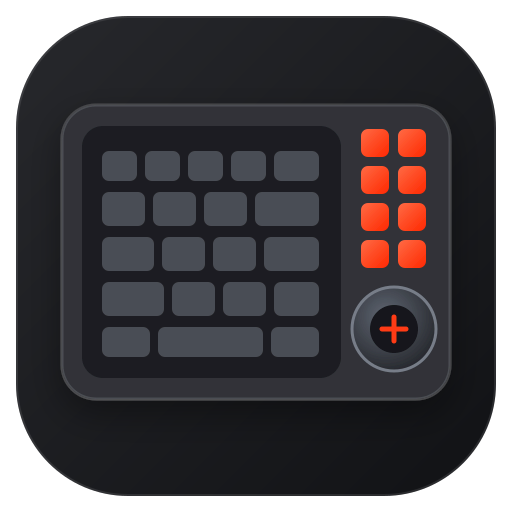

# IO Center for Linux

<p align="center">
  
</p>

An independent community interface for the **be quiet! Dark Mount**:
display-key images, Media Dock controls, onboard and LampArray lighting,
Linux shortcuts, and CPU/GPU utilization indicators.

> **Unofficial project:** This project is not affiliated with be quiet! and is
> not supported by the manufacturer. Product and brand names are used solely
> to describe compatible hardware.

Current preview version: **0.1.0** · License: **GPL-3.0-only**

Contact: **`fechyyyyy` on Discord**

## Safety rule

**Firmware functionality is documented, but never implemented, invoked, or
modified.** Firmware updates remain the sole responsibility of the official
web app at <https://iocenter.bequiet.com/>, which works correctly on Linux.

`bqkeyd.py` opens the HID interface with `O_RDONLY`. The process is therefore
structurally unable to send anything to the device—neither configuration nor
firmware commands.

## Quick start from source

Requires Python 3.11 or newer, PyQt 6, and Pillow:

```bash
python3 -m pip install --user -r requirements.txt
./bqgui.py
```

The personal configuration is created automatically at
`~/.config/iocenter-linux/config.toml` on first launch. An existing
project-local `config.toml` and legacy backups are copied once, never
overwritten or deleted.

If device access is missing, a prominent setup banner appears automatically.
The manual commands are also documented under [Device access](#device-access).
Native package definitions are included for Arch Linux, Debian/Ubuntu, and
Fedora; publication in their respective package repositories will follow the
first signed release.

### User data

| Content | Path |
|---|---|
| Configuration | `~/.config/iocenter-linux/config.toml` |
| Image backups | `~/.local/state/iocenter-linux/backups/` |
| Read key images | `~/.local/state/iocenter-linux/images/` |
| Short-lived write-throttle state | `~/.cache/iocenter-linux/` |

The base directories respect `XDG_CONFIG_HOME`, `XDG_STATE_HOME`, and
`XDG_CACHE_HOME`. Uninstalling intentionally leaves personal assignments and
backups untouched.

## Features

### User interface (`bqgui.py`)

After installing a native package: application menu → **“IO Center for
Linux”**. Directly from the project directory:

```bash
./bqgui.py
```

Before the first device access, the application displays a detailed safety
and liability notice. The main window is created and the keyboard opened only
after explicit confirmation. The accepted notice version is stored in the Qt
user settings; after a later material text change, the application can request
confirmation again. The contact button copies the Discord name `fechyyyyy` to
the clipboard.

**“Help & contact”** remains accessible in the bottom-right corner. It lets
users copy the Discord name again, review the safety notice, and inspect the
effective access to vendor HID, LampArray, and `/dev/uinput`. The diagnostic
deliberately does not rely on one particular rule name: a different local udev
rule may also grant the correct ACLs.

If the Dark Mount is connected but HID access is missing, a prominent setup
banner automatically appears directly above the tabs. The same applies to
`/dev/uinput` when virtual keys are enabled. The banner leads straight to the
setup without requiring users to search for it. **“Later”** hides it only for
the current session; it reappears on the next launch while the permission is
still missing. A keyboard that is merely disconnected does not trigger a udev
warning.

Three sections:

| Section | Content |
|---|---|
| **Keys** | the eight display keys—image, virtual key, command |
| **Media Dock** | read/write idle image, menu colour, display mode, time format, timeouts |
| **Lighting** | onboard effects, LampArray, and CPU/GPU utilization across two key rows |

A pressed key lights up in its card, making assignment straightforward. Each
key can have a virtual key (F13–F24), a command, or both; autostart is enabled
with one button. Settings are stored in
`~/.config/iocenter-linux/config.toml`, which is also read by the daemon—manual
editing remains possible.

The visual system lives in [`bqui.py`](bqui.py): a 4 px spacing grid, clear
hierarchies, and colours derived from the desktop palette so the window fits
both light and dark themes. The device accent `#ff2800` marks only the primary
action. Cards respond subtly to pointer and keyboard interaction; status pills
show which lighting mode was most recently activated.

Secondary text and borders are derived through `muted()` and `border()` from
the **WindowText** role with reduced opacity—**not** from `Mid`. Mid is a
useful grey in light themes, but a dark border colour in dark themes; text
using it disappears into the background. Deriving these colours from the text
colour keeps the contrast correct in both directions.

During a device operation, a slightly elevated blocking layer covers the
entire window. A small spinner is shown for operations of unknown duration;
dock and key-image transfers use a determinate progress bar indicating the
amount read or transferred. The eight key images are collected and displayed
together only after the complete read operation. Tabs, page content, and the
header are disabled during this time. The window can be closed or restarted
for a language change only after the hardware thread has finished: **the
keyboard answers only one request at a time**, and concurrent access could
disrupt a transfer.

`set_busy()` counts active operations instead of merely toggling a flag.
`setOverrideCursor` uses a stack—without the counter, the wait cursor would
remain stuck after the first completed operation. The loading layer appears
immediately, while a shadow clearly separates it from the inactive background.
Additional decorative animations are intentionally avoided.

`fix_placeholder_contrast()` also checks the **PlaceholderText** role at
startup. Some themes leave it unset, causing placeholder text to remain black
and disappear in dark interfaces. It is replaced only when contrast against
the input field is too low; a correctly configured theme remains untouched.

#### Languages

German and English, switchable in the top-right corner. The language is stored
under `[ui] language` in `config.toml`; otherwise it is inferred from the
environment.

Implemented in [`bqi18n.py`](bqi18n.py), deliberately **without** Qt
translation files: no `.ts`/`.qm`, no `lupdate`/`lrelease`, and no additional
build step. The German strings are the keys and the English strings live in a
table. If an entry is missing, the German text appears, so the interface always
remains usable.

Switching languages restarts the application instead of relabelling every
widget in place. This guarantees that no text from the previous language
remains on screen.

When saving, the GUI replaces only the TOML tables it manages. `[ui]`,
comments, and unknown custom tables remain intact; the file is atomically
replaced through a temporary file. Translated default names such as “Key 1”
are not persisted, allowing them to follow the selected language.

Check whether all interface strings are covered:

```bash
python3 -c "
import ast, bqi18n
tree = ast.parse(open('bqgui.py', encoding='utf-8').read())
loose = [(n.lineno, n.value) for n in ast.walk(tree)
         if isinstance(n, ast.Constant) and isinstance(n.value, str)
         and n.value in bqi18n.ENGLISH]
print(len(loose), 'matches—wrapped in tr()?')"
```

The command-line tools (`bqimage.py`, `bqdock.py`, `bqlight.py`, and
`bqprobe.py`) continue to output German only.

Commands do not need to be typed manually:

- **Application …** lists installed programs from the `.desktop` directories
  (`XDG_DATA_DIRS` and `XDG_DATA_HOME`) with icon, search field, and tooltip.
  Field codes such as `%U` are removed; entries with `Terminal=true`
  automatically receive a `konsole -e` prefix.
- **File …** selects a custom script or executable; paths containing spaces
  are quoted.

If the name field is still empty, the selection fills it automatically.

### Display-key daemon (`bqkeyd.py`)

The keyboard reports every press through its vendor HID interface with a
unique ID—**regardless of whether an assignment exists in the web app**.
Nothing needs to be reconfigured there.

Two modes can be used independently or together:

- **Virtual key** (`[uinput] enabled = true`)—on each press, the daemon emits
  an F13–F24 key through `/dev/uinput`. KDE sees it as a regular keyboard, so
  the key can be recorded normally under *Shortcuts* in System Settings and
  assigned to **any** KDE action. This is required because the display keys do
  not emit keycodes on their own.
- **Command** (`command = "…"`)—launches a program or script directly.

The hardened daemon launches desktop commands through `systemd-run --user` in
a separate transient user unit. Its `ProtectHome` and network restrictions
therefore remain on the daemon instead of being unintentionally inherited by
the launched desktop application.

```bash
./bqkeyd.py --list-keys   # Show the ID reported by each key
./bqkeyd.py               # Run in the foreground
```

The GUI configures autostart with one button. It creates
`~/.config/systemd/user/bqkeyd.service` using the **actual** paths of the
current installation, the active Python interpreter, and the XDG
configuration. The repository therefore needs neither a fixed name nor a
fixed location. The unit is attached to the user `default.target` and started
immediately.

```bash
systemctl --user status bqkeyd.service
journalctl --user -u bqkeyd.service
```

After successful setup, the same button becomes **“Remove autostart”**. After
confirmation, the GUI runs `disable --now`, removes exactly its own user unit,
and reloads the user manager. Configuration and key images remain intact.

This works on normal desktop installations of Arch Linux, Fedora, and Debian,
which use systemd with a user manager. On variants deliberately installed
without systemd, in some containers, and in sessions without a reachable user
bus, nothing is left half-installed; the GUI displays a clear error instead.
An XDG autostart fallback is not currently implemented.

### Reading key images (`bqimage.py`)

This is the first tool that actually sends anything to the device. The
**“Load key images”** button in the GUI uses it to display each key's real
image.

```bash
./bqimage.py --verify 2          # Read and compare with the capture
./bqimage.py --key 3 -o /tmp/k3.jpg
./bqimage.py --all               # Save to ~/.local/state/iocenter-linux/images/
```

Change images through **“Change image …”** in the GUI, including a preview and
crop control, or from the command line:

```bash
./bqimage.py --write 7 ~/Pictures/artwork.png --zoom 2.5
./bqimage.py --restore 7 ~/.local/state/iocenter-linux/backups/key7-….jpg
```

Every image is automatically cropped to a square, resized to 120 × 120,
pre-rotated, and encoded as JPEG.

In the image dialog, **“Choose app icon …”** opens a gallery of installed
applications. Search results also include local Linux icon packages, making
thousands of additional app and brand icons available without copying them
into this project. Transparent icons are padded onto a dark,
display-appropriate background and then passed through the same size,
rotation, and JPEG checks as normal images.

#### Safeguards

- **Allowlist instead of blocklist.** `_send()` recognizes exactly two
  allowed commands: `0x20 0x03` (read) and `0x20 0x02` (write). Both are fully
  documented by a capture from the official web app, not guessed. Every other
  command is rejected before a byte leaves the program—unknown operations are
  excluded by default, not merely forbidden by name.
- **Bounds.** The key ID must be within `0x6d..0x74`, the offset must remain
  inside the image region, and the payload is limited to 49 bytes. Including
  its header, an image may not exceed `MAX_IMAGE_BYTES` (32 KB);
  `encode_for_key()` targets half that limit. For comparison, the web app
  accepts 2 MB source files, while the images actually written ranged from 6
  to 17 KB. The same limit applies to `--restore`, where bytes are written
  unchanged.
- **Backups cannot be disabled.** Before every write, the existing image is
  read and stored with a timestamp under
  `~/.local/state/iocenter-linux/backups/`; it is then read back and compared
  byte for byte after the write.
- Responses are checked using both CRC **and** sequence number so an
  intervening heartbeat cannot be misinterpreted as image data.

#### Verified

| Direction | Evidence |
|---|---|
| Read | `--verify 2` was byte-identical to the `key2.jpg` reconstructed from the capture |
| Write | key 8 was written back unchanged and read back byte-identically |
| New image | custom artwork was written to key 7 and read back byte-identically |

### Media Dock (`bqdock.py`)

The top-left module has its own **320 × 240** display and the firmware views
CLOCK, ILLUMINATION, BRIGHTNESS, PROFILE, MEDIA, and CUSTOM.

```bash
./bqdock.py --settings
./bqdock.py --read-image /tmp/dock.png
./bqdock.py --image ~/picture.png
./bqdock.py --color '#00ff00' --display image
```

In the GUI, **“Read from dock”** retrieves the currently stored idle image and
displays it without writing to the device.

Allowlist: `21 01` (info), `21 02` (read settings), `21 03` (write settings),
`21 05` (set clock), `21 06` (read idle image), and `21 07` (write idle
image). `21 06` is a read-only path; the command assignment and response
format are documented by the Media Dock firmware and additionally protected
by strict size and format bounds. A complete readback was verified on the
connected keyboard with MCU firmware 1.29.0.

Protocol:

```
21 07   bytes 8..11  Offset (uint32)       bytes 12..  Image data (49/report)
21 03   bytes 7..9   Menu colour RGB
        byte 10      Time format: 1 = 24 h, 0 = 12 h
        byte 11      Display: 1 = clock, 2 = image
        bytes 12,13  Idle image after … seconds (uint16)
        bytes 14,15  Display off after … seconds (uint16, 0 = never)
```

The display accepts **uncompressed RGB565**—320 × 240 × 2 plus a 9-byte
header, or 153,609 bytes across 3,136 reports, taking about five seconds. The
image is stored as the idle image in flash, so `write_image()` enforces a
minimum interval of 20 seconds. The timestamp lives in the user cache and
therefore remains effective across process restarts. Before writing, both GUI
and CLI back up the old image; afterwards they read the new image back and
compare it byte for byte. This path is **not** suitable for frequently changing
content.

### Lighting (`bqlight.py`)

The six onboard effects continue running on the device even without a
computer.

```bash
./bqlight.py --list
./bqlight.py --effect static --color '#ff2800' --brightness 80
```

Allowlist: `01 01` (open QLink session), `01 02` (close it), and the sole
payload command `10 06` (set effect). A fixed session ID—or one merely copied
from an old heartbeat—is insufficient for lighting: the device otherwise
rejects the report with status 9. Responses containing an error status are no
longer shown as successful in the GUI.

```
byte  7   Zone (always 0 in the capture)
byte  8   Effect: 0 Static, 1 ColorWave, 2 Tornado, 3 Breathing,
                  4 Reactive, 5 Matrix
byte  9   Direction
byte 10   Brightness 0..100
byte 11   Speed 0..100
byte 12   Colour mode: 0 = one colour, 1 = two, 2 = palette
from 13   Mode 2: count, then RGB triples; otherwise RGB directly
```

The number of colours determines the mode, exactly as in the web app: one
colour → mode 0, two → mode 1, more → palette (up to 8).

After applying an effect, the GUI also releases any active LampArray control.
Otherwise, the onboard effect would be stored but remain invisible while host
mode was still active.

### Device information (`bqdevice.py`)

The **“Device info”** button reads the model, hardware revision, serial number,
and firmware versions of all three MCUs. From the command line:

```bash
./bqdevice.py
```

The tool has a read-only allowlist containing `03 01` and `03 02`; both
commands are documented in the available WebHID capture.

### PC-controlled lighting (`bqlamp.py`)

On its fourth HID interface, the keyboard implements the **open HID LampArray
standard** (Usage Page `0x59`, HID Usage Tables 1.4)—nothing is emulated or
guessed here. It reports **201 lamps** across 440 × 140 mm and provides every
LED position in micrometres, allowing gradients to be calculated
geometrically instead of relying on a hard-coded layout.

```bash
./bqlamp.py --info
./bqlamp.py --solid '#ff2800'
./bqlamp.py --gradient '#ff2800' '#0028ff' --axis y
./bqlamp.py --release
```

Feature reports 1–6 according to the device descriptor: read attributes,
request and receive a lamp, multi- and range updates, and `AutonomousMode`.
The sequence is always: take control (`AutonomousMode = 0`), set colours, then
release control. Without the final `LAMP_UPDATE_FLAG_UPDATE_COMPLETE` bit in
the last report, the device applies nothing.

Unlike `bqlight.py`, these colours exist only while the computer is sending
them, but every LED can be addressed individually. Conversely, the six
onboard effects continue without a computer but are predefined. If an onboard
effect is subsequently applied in the GUI, it automatically releases any
remaining LampArray control so the chosen colour becomes visible immediately.

### CPU/GPU utilization (`bqmeter.py`)

The live monitor uses two rows of ten keys as percentage indicators:

| Row | Metric | Levels |
|---|---|---|
| `F1`–`F10` | GPU utilization | 10–100% |
| `1`–`0` | CPU utilization | 10–100% |

In the GUI, the monitor is located under **Lighting → Load meter**. By
default, only the current level lights up in each row; a filled bar can be
selected instead. Orange represents the GPU, blue the CPU. **“Swap rows”**
reverses the CPU and GPU rows.

From the command line:

```bash
./bqmeter.py                       # Current level, until Ctrl-C
./bqmeter.py --mode bar            # Filled bar
./bqmeter.py --swap                # GPU on 1–0, CPU on F1–F10
./bqmeter.py --show-keys           # Detected lamp IDs, read-only
```

CPU data comes from `/proc/stat`. AMD GPUs are read through
`/sys/class/drm/card*/device/gpu_busy_percent`; NVIDIA GPUs use `nvidia-smi`.
The row assignment is verified against the geometry and sequential lamp IDs
reported by the device. On an unknown layout, the monitor stops instead of
guessing which keys to use.

At startup, the host takes LampArray control and turns off all other LEDs.
When stopped or interrupted with `Ctrl-C`, it reliably restores
`AutonomousMode`, allowing the previous onboard effect to reappear. No QLink
access or flash write is involved.

### Dock clock

When connecting, the web app sends `21 05` with Unix time; without it, the
CLOCK view gradually drifts. The interface provides **“Set clock”**, and the
command-line equivalent is:

```bash
./bqdock.py --set-time
```

The **local** time is transferred as seconds since 1970—the device has no
timezone and displays the value unchanged.

After `21 05`, the keyboard sends an **unsolicited** `21 03` response with a
`4` in the first byte followed by the accepted time. `confirmed_time()`
collects this message; because it was not requested, its sequence number is 0
and it cannot be retrieved through `_response()`.

### Bytes 10 and 11 were reversed

The two fields looked nearly identical, and one capture was insufficient to
determine which was which. The incorrect mapping caused switching from image
to clock to appear ineffective.

[`dock_test.py`](dock_test.py) resolved it by holding one field constant while
changing only the other. The result was **clock, image, image, clock**—the
display follows byte 11, not byte 10.

A cross-check against the dock capture confirms the corrected mapping: all six
steps performed by the web app map cleanly to the actual interactions (image
→ colour → idle timeout → time format → clock). With the old mapping, the last
two steps made no sense.

An earlier workaround briefly toggled the format back and forth to force a
redraw. It has been removed: it treated a symptom of the incorrect
interpretation and caused the image to flash briefly each time.

### Why the dock may appear unchanged

**As soon as a computer communicates with the dock, it shows its menu**—the
same behaviour as the web app. Clock and image are *idle views*: they appear
only after the configured period without input.

No command that switches the view immediately was observed in any capture.
The interface therefore confirms success through the device response rather
than the screen—for example, by showing the confirmed time in the status line
after setting the clock.

### Device access

A udev rule assigns ACLs to the required HID interfaces through the `uaccess`
tag. The application then runs without root and without a `plugdev` group.

For a new installation, the project includes a narrow rule for `373f:0001` as
[`70-iocenter-dark-mount.rules`](70-iocenter-dark-mount.rules):

```bash
sudo install -Dm644 70-iocenter-dark-mount.rules \
  /etc/udev/rules.d/70-iocenter-dark-mount.rules
sudo udevadm control --reload-rules
sudo udevadm trigger
```

Reconnect the keyboard once afterwards. The optional uinput line does not
grant blanket mode `0666`; it gives access only to the active seat user.

Under **“Help & contact”**, the interface displays the same status directly
and can copy the three commands above for a source installation to the
clipboard. The application itself never requests root privileges or modifies
`/etc` invisibly. A manually installed project rule can also be removed there
after a warning; again, the application only copies the visible terminal
command.

The included AUR, DEB, and RPM package definitions ship the rule as a package
file at `/usr/lib/udev/rules.d/70-iocenter-dark-mount.rules`. The package
manager installs and removes it together with the application, and a package
script reloads the rules afterwards. Package users therefore do not need to
copy the file manually. Flatpak, by contrast, cannot install this host rule by
itself.

## Hardware findings

USB `373f:0001`, four HID interfaces:

| Node | Interface | Purpose |
|---|---|---|
| `hidraw5` | input0 | Standard keyboard (8-byte boot reports) |
| `hidraw6` | input1 | NKRO, mouse, consumer, and system controls |
| `hidraw16` | input2 | **Vendor-defined** (Usage Page `0xFF00`), 64 bytes, IN+OUT |
| `hidraw17` | input3 | **HID LampArray** (Usage Page `0x59`) |

The kernel assigns hidraw numbers in connection order, so they change after
reconnecting. `bqkeyd.py` therefore locates the interface through its report
descriptor instead of relying on a fixed path.

### Lighting is standardized

`hidraw17` fully implements **HID LampArray** (Usage Page `0x59`, HID Usage
Tables 1.4): lamp count, every LED position in micrometres, individual and
range updates, and `AutonomousMode` for host control. Per-key RGB can therefore
be implemented against a public specification and requires **no** reverse
engineering. The feature reports are:

| ID | Usage | Function |
|---|---|---|
| 1 | `LampArrayAttributes` | Lamp count, bounding box, update interval |
| 2 / 3 | `LampAttributesRequest/Response` | Position, colour depth, purpose per lamp |
| 4 | `LampMultiUpdate` | Set 8 individual lamps |
| 5 | `LampRangeUpdate` | Set a range of lamps |
| 6 | `LampArrayControl` | `AutonomousMode` |

Importantly, lighting uses this standards-based channel and is therefore
physically separate from the vendor channel that also carries firmware.

### Vendor protocol (`hidraw16`)

64-byte reports without a report ID. Empirically determined layout:

```
byte 0      Payload length (0x06 heartbeat, 0x0a/0x0b key event)
byte 2      Session/connection counter
bytes 5,6   Event ID—0x11 0x02 = display key, 0x01 0x03 = heartbeat
byte 7      Key ID
byte 9      0x01 = pressed
bytes 10,11 Action assigned in the web app (0x00 0x00 = none)
last 2      CRC-16/MODBUS over bytes 0–61
```

Display-key IDs from left to right: `0x6d`–`0x74`.

#### Checksum

The last two bytes of every report are **CRC-16/MODBUS** over bytes 0–61,
stored little-endian (reflected polynomial `0x8005` = `0xA001`, initial value
`0xFFFF`, no final XOR). Verified against 3,157 captured reports without a
single mismatch.

#### Display-key images

| Command | Bytes 5–6 | Direction |
|---|---|---|
| Read image | `20 03` | Request is short; response carries data |
| Write image | `20 02` | Request carries data; response is an empty acknowledgement |

Request layout:

```
byte 0       Index of the last valid byte (not the length!)
byte 4       Sequence number pairing request and response
bytes 5,6    Command
byte 7       Key ID (0x6d..0x74)
bytes 9..12  Image-memory offset (uint32 little-endian)
byte 13      Read request: byte count / write request: data starts here
```

Payload: 54 bytes per report when reading, 49 when writing. Image memory starts
with a 9-byte header followed by the JPEG:

```
uint32  Total length including this header
uint16  Width   (120)
uint16  Height  (120)
uint8   Format  (3)
```

**Images are stored rotated by 90°** because the displays are physically
mounted sideways. Rotate 90° counter-clockwise for viewing; a custom image
must be rotated accordingly before writing or it will appear sideways on the
key.

The keyboard also sends an **unsolicited** heartbeat once per second with an
incrementing seconds counter. This is presumably the mechanism through which
the Windows service `bequietIOCenterService` sends system data to a display,
but this remains unconfirmed.

## Windows installer analysis

`IO Center Installer.exe` is an Inno Setup 6.3.0 package containing 1,526
files. It cannot be opened with `innoextract` 1.9, which supports only up to
6.0.5; the file list was instead obtained by directly decompressing the LZMA1
header block.

It is **not** an Electron app, but **Qt 6 with QML**—roughly 45 `Qt6*.dll`
files, `IO_Center.exe`, and `hidapi.dll` for HID communication. Ghidra offers
little value here: lighting follows an open standard, and the vendor protocol
exists as readable JavaScript in the web app.

Additional components:

- `bequietIOCenterService.exe`—Windows *“hardware data service”*, configured
  for autostart with `depend= Tcpip`; accompanied by a `cpuid/` directory,
  indicating sensor data
- `Qt6RemoteObjects.dll`—IPC between GUI and service
- `video-converter-cli.exe`—media conversion for the display keys
- `device_components.bin`, `devices_manifests.bin`—device definitions

The installer contains **no** firmware images: no `.fw`, `.hex`, or `.dfu`
files and no DFU or bootloader strings. Firmware is downloaded at runtime.

## Resolved and ruled out

**There is no system-data view on the keyboard display.** The Dark Mount
manifest contains neither a `Sensors` section nor a `DisplaySetup` subscreen;
both exist only for be quiet! LCD liquid coolers. The Windows service
`bequietIOCenterService` and its `cpuid/` directory collect sensor data for
**those devices**, not the keyboard. There is therefore nothing to reproduce
here.

**The dock's MEDIA view remains empty for now.** The web app does not populate
it, even with music playing in the same browser. Group `0x12`, initially
considered a candidate, appears in the lighting capture for Reactive and
Matrix and apparently has nothing to do with media. `bqprobe.py` queries it
(`12 01` → `00 00`), but the result is ambiguous. Capturing the Windows
software in a VM would be the next rigorous step.

As a workaround, title and artist could be rendered into an image and written
to the dock, but with 153 KB per update and flash storage underneath, only
long update intervals would be sensible.

## Open items

- [ ] Determine the meaning of `0x12 0x09` / `0x12 0x0a`, which are sent when
      switching to Reactive and Matrix
- [ ] Determine onboard-effect **direction** (byte 9): values 0, 1, 3, and 4
      appeared in the capture, but their mapping to directions is unknown
- [ ] LampArray animations—the building blocks are ready, but a daemon that
      calculates frames cyclically is still needed (30 Hz according to
      `min_update_interval`)
- [ ] **Change key assignments**: reading (`11 01`, 22 entries) is documented,
      writing is not—it requires a capture, not guesswork
- [ ] **Macros** (15 with 200 events each according to the manifest),
      **profiles**, and **game mode**—mentioned in the manifest, but no command
      has been observed

## Acknowledgements

Parts of the protocol research—particularly Media Dock image readback, device
information, and explicit QLink session setup—were informed by
[`fbnlrz/darkmount-linux`](https://github.com/fbnlrz/darkmount-linux), licensed
under GPL-3.0-only.

No source code was copied. The relevant protocol behaviour was independently
implemented in Python and verified against device captures and real hardware.
See [`DARKMOUNT_REVIEW.md`](DARKMOUNT_REVIEW.md) for the detailed comparison.

## Development and license

- Contributions and safety boundaries: [`CONTRIBUTING.md`](CONTRIBUTING.md)
- Private security reports: [`SECURITY.md`](SECURITY.md)
- Changes: [`CHANGELOG.md`](CHANGELOG.md)
- Release process and package verification:
  [`docs/RELEASING.md`](docs/RELEASING.md)
- Comparison and provenance of protocol findings:
  [`DARKMOUNT_REVIEW.md`](DARKMOUNT_REVIEW.md)

Copyright © 2026 `re133`. Released under
[`GPL-3.0-only`](LICENSE), without warranty to the extent permitted by law.
